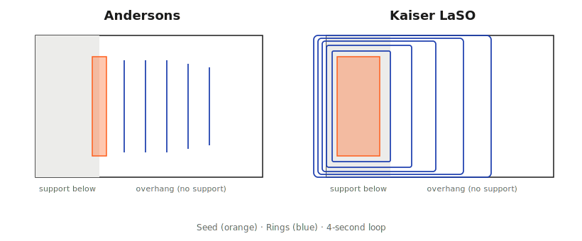
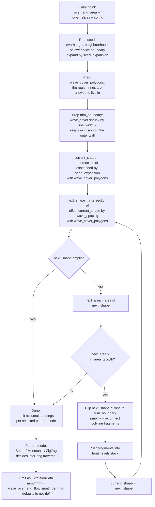
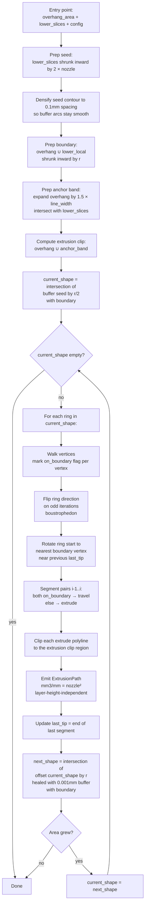

# Wave overhang algorithms

This document explains the two wave-overhang algorithms this fork ships, how they differ, how each iterates step-by-step, and where to find the source that implements them.

## Contents

1. [Overview: two opposite approaches](#overview-two-opposite-approaches)
2. [Andersons](#andersons)
3. [Kaiser LaSO](#kaiser-laso)
4. [Which one to pick](#which-one-to-pick)

---

## Overview: two seed shapes, same growth direction

Both algorithms compute a **seed** geometry at or near the supported edge of the overhang, then propagate rings outward from that seed into the unsupported region. Each new ring bonds to the previous one. The loop ends when the rings can't grow further inside the current layer.

The real differences between the two are **what the seed looks like** and **what each iteration offsets**:

|  | Andersons | Kaiser LaSO |
|---|---|---|
| **Seed** | Narrow band along the support-overhang boundary | Full lower-slice polygon shrunk inward by 2 × nozzle (treated as a closed curve) |
| **What each iteration offsets** | The accumulated filled region | The previous ring (a curve) |
| **What an iteration emits** | A polyline sampled along the new outline (a wavefront) | A closed ring around the previous ring |
| **How rings connect** | Pattern mode: Smart / Monotonic / ZigZag | Strict lateral offset of the previous ring |
| **Loop terminates when** | New area growth falls below a threshold (saturation) | The outward offset can't grow further inside the current-layer boundary |
| **Flow model** | Shared: `wave_overhang_flow_mm3_per_mm`, defaults to `nozzle²` (layer-height-independent) | Shared: `wave_overhang_flow_mm3_per_mm`, defaults to `nozzle²` (layer-height-independent) |

## Andersons

### Research origin

Wave-overhang research by Janis A. Andersons (University of Twente), building on Steven McCulloch's arc-overhang work. Original slicer integration in [stmcculloch/PrusaSlicer-WaveOverhangs](https://github.com/stmcculloch/PrusaSlicer-WaveOverhangs), which is the direct ancestor of our Andersons implementation.

### How it iterates

### Key parameters

- `wave_overhang_line_spacing`: distance between successive wavefronts
- `wave_overhang_pattern`: Smart / Monotonic / ZigZag, affects how rings are traversed after all are generated
- `wave_overhang_perimeter_overlap`: how far waves extend toward the outer wall
- `wave_overhang_minimum_width`: split waves at narrow necks narrower than this
- `wave_overhang_min_new_area`: saturation threshold
- `wave_overhang_flow_mm3_per_mm`: shared with Kaiser; see [shared flow setting](#shared-flow-setting)

### Source

- `src/libslic3r/WaveOverhangs/WaveOverhangs.cpp`: the algorithm body
- `src/libslic3r/WaveOverhangs/AndersonsGenerator.cpp`: pluggable wrapper

### Our divergences from stmcculloch's fork

- Added configurable seam modes (Alternating / Aligned / Random) on top of the pattern mode
- Added per-wave cooling overrides (fan speed, nozzle temp, min wave time, min layer time)
- Added `max_iterations` safety cap
- Removed unused `PropagationParams` knobs (`wavefront_advance`, `discretization`, `arc_resolution`) that were plumbed but never wired up

---

## Kaiser LaSO

### Research origin

[Rieks Kaiser's MSc thesis](https://github.com/riekskaiser/wave_LaSO) under Andersons' supervision at the University of Twente. Reference Python (`CustomSupportInjector.py`) is a G-code post-processor that replaces the original overhang-layer perimeters with lateral offset waves.

### How it iterates

### Python → C++ mapping

Every step in the flowchart above maps to a specific line in Kaiser's [CustomSupportInjector.py](https://github.com/riekskaiser/wave_LaSO/blob/master/CustomSupportInjector.py):

| Flowchart step | Python line | Python code |
|---|---|---|
| Seed from lower-slice outer wall, shrunk by 2×nozzle | 174 | `seedpoly = Polygon(seedshape).buffer(-2*nozzlesize)` |
| First ring at r/2 | 403 | `bin1, bin2, shape = offsets(seed_curve, r/2)` |
| Clip to boundary | 404 | `current_shape = shape.intersection(boundary_polygon)` |
| Mark on-boundary vertices | 427-434 | `if boundary_polygon.boundary.distance(Point(x,y))<1e-6: isOnBoundary[j] = True` |
| Direction flip on odd iterations | 440-448 | `if i%2==0: ... else: list(reversed(...))` |
| Rotate ring start to closest boundary vertex to last_tip | 455-459 | `first_index = closest_point(xlast, ylast, points_filtered, isOnBoundary)` |
| Extrude vs travel decision | 473-490 | `if (isOnBoundary_filtered[j-1] and isOnBoundary_filtered[j]): # G0 else: # G1` |
| Flow per mm travel (default nozzle²; configurable) | 56 | `Efactor = nozzlesize**2/(0.25*np.pi*1.75**2)` |
| Offset previous ring by r | 533 | `a,b,next_shape = offsets(coords, r=r)` |
| Heal with 0.001mm buffer, clip to boundary | 534 | `current_shape = next_shape.buffer(0.001).intersection(boundary_polygon)` |
| Loop while current_shape non-empty | 414 | `while not current_shape.is_empty and i < 10e4` |

### Key parameters

- `wave_overhang_ring_overlap`: fraction by which successive rings overlap (default 0.15 matches Kaiser's reference)
- `wave_overhang_max_iterations`: safety cap on ring count
- `wave_overhang_flow_mm3_per_mm`: shared with Andersons; see [shared flow setting](#shared-flow-setting)

## Shared flow setting

Both algorithms use `wave_overhang_flow_mm3_per_mm` to control how much plastic is extruded per millimetre of wave-overhang line. The default is `0.16` mm³/mm, which equals `nozzle²` for a 0.4 mm nozzle (and matches Kaiser's reference calibration).

Why a fixed mm³/mm rather than a layer-height-dependent ratio: a wave-overhang line hangs in air, not squished against a layer below. There's nothing to squish into, so layer height has no effect on the bead's cross-section. Only the nozzle bore and the mm³/mm extrusion rate set the bead size.

Recommended values for other nozzle sizes:

| Nozzle | `wave_overhang_flow_mm3_per_mm` |
|---|---|
| 0.3 mm | 0.09 |
| 0.4 mm | **0.16 (default)** |
| 0.5 mm | 0.25 |
| 0.6 mm | 0.36 |
| 0.8 mm | 0.64 |

Raise if wave lines look thin or broken; lower if they blob together. The value applies identically to Andersons and Kaiser, so tuning transfers between algorithms.

### Source

- `src/libslic3r/WaveOverhangs/KaiserGenerator.cpp`: full port
- `src/libslic3r/WaveOverhangs/KaiserGenerator.hpp`: interface

### Our divergences from Kaiser's Python

1. **Slicer-pipeline integration** (Kaiser's Python is a G-code post-processor). We generate rings at slice time and hand them to Orca as ExtrusionPaths; Kaiser reads a pre-sliced G-code and replaces the overhang layer.
2. **Extrusion clip: overhang + anchor band, instead of the full ring**. Kaiser can extrude through the supported region too because his post-processor replaces the original perimeters. We run alongside Orca's normal perimeter generator, so extruding over supported material would double-extrude. Clipping to overhang-only broke the anchor bond; we ended up with `overhang ∪ (expand(overhang, 1.5 × line_width) ∩ lower_slices)` which preserves the first-ring anchor while still staying off distant top surfaces.
3. **Multi-overhang handling per layer** (Kaiser's Python processes one region at a time with user prompts).
4. **No pin-support placement**. Kaiser's original drops discrete pin-support nubs under the overhang; this fork aims for fully support-free overhangs and uses `support_remaining_areas_after_wave_overhangs` instead.

---

## Which one to pick

Both algorithms are still in active research and get tuned frequently. Neither one is strictly better yet. The honest answer is: try both on your model and see what actually lands for your printer, filament, and geometry.

Please upload your results (success or failure) at [waveoverhangs.com](https://waveoverhangs.com). Every data point helps shape what the defaults and the per-geometry recommendations should be, and shows other people what has worked for which setup.
